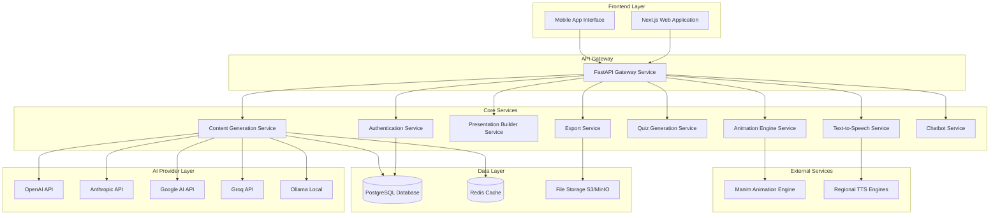

# Design Document: Medhavi AI Education Platform

## Overview

Medhavi is a comprehensive AI-powered education platform designed to democratize quality education through intelligent content generation, multilingual support, and regional accessibility. The platform employs a microservices architecture built on FastAPI backend services and a Next.js frontend, integrating multiple AI providers to generate educational content including presentations, animations, quizzes, and multilingual narration.

The system addresses the critical need for accessible, high-quality educational content in regional languages, particularly focusing on Indian languages and cultural contexts. By leveraging modern AI capabilities and robust architectural patterns, Medhavi provides educators with powerful tools to create engaging, personalized learning experiences while maintaining offline accessibility for areas with limited connectivity.

## Architecture

### High-Level Architecture

The platform follows a distributed microservices architecture with clear separation of concerns:



### Service Architecture Pattern

Each microservice follows the Model-Controller-Service (MCS) pattern:

- **Controllers**: Handle HTTP requests, validation, and response formatting
- **Services**: Implement business logic and orchestrate operations
- **Models**: Define data structures and database interactions
- **Repositories**: Abstract data access patterns

### Scalability Considerations

- **Horizontal Scaling**: Services can be independently scaled based on demand
- **Load Balancing**: API Gateway distributes requests across service instances
- **Caching Strategy**: Redis caches frequently accessed content and AI responses
- **Async Processing**: Background job queues handle resource-intensive operations
- **Circuit Breakers**: Prevent cascade failures between services

## Components and Interfaces

### 1. Authentication Service

**Purpose**: Manages user authentication, authorization, and institutional account management.

**Key Components**:
- JWT token management with refresh token rotation
- Role-based access control (RBAC) with hierarchical permissions
- Institutional account management with quota tracking
- Single sign-on (SSO) integration capabilities

**API Endpoints**:
```
POST /auth/login
POST /auth/register
POST /auth/refresh
GET /auth/profile
PUT /auth/profile
POST /auth/logout
GET /auth/institutions/{id}/users
PUT /auth/users/{id}/permissions
```

**Database Schema**:
- Users table with profile information and preferences
- Roles and permissions with hierarchical structure
- Institutions table with quota and billing information
- User sessions with device tracking

### 2. Content Generation Service

**Purpose**: Orchestrates AI-powered content creation across multiple providers with fallback mechanisms.

**Key Components**:
- Multi-provider AI client with automatic failover
- Content validation and quality assurance
- Template-based content structuring
- Cultural adaptation for regional contexts

**Provider Integration Pattern**:
```python
class AIProviderInterface:
    async def generate_content(self, prompt: str, context: dict) -> ContentResponse
    async def health_check(self) -> bool
    def get_usage_stats(self) -> UsageStats

class ContentOrchestrator:
    def __init__(self, providers: List[AIProviderInterface]):
        self.providers = providers
        self.circuit_breakers = {p: CircuitBreaker() for p in providers}
    
    async def generate_with_fallback(self, request: ContentRequest) -> ContentResponse:
        for provider in self.providers:
            if self.circuit_breakers[provider].is_closed():
                try:
                    return await provider.generate_content(request.prompt, request.context)
                except Exception as e:
                    self.circuit_breakers[provider].record_failure()
                    continue
        raise AllProvidersFailedException()
```

**API Endpoints**:
```
POST /content/generate
GET /content/{id}
PUT /content/{id}
DELETE /content/{id}
GET /content/templates
POST /content/validate
```

### 3. Presentation Builder Service

**Purpose**: Creates structured presentations with multiple templates and multilingual support.

**Key Components**:
- Template engine with customizable layouts
- Multilingual content adaptation
- Slide structure optimization
- Export format management

**Template System**:
- **General Template**: Clean, academic-focused design
- **Modern Template**: Contemporary visual elements with animations
- **Standard Template**: Traditional presentation format
- **Swift Template**: Minimalist, fast-loading design
- **Techfest Template**: Technical conference styling

**API Endpoints**:
```
POST /presentations/create
GET /presentations/{id}
PUT /presentations/{id}/slides
POST /presentations/{id}/export
GET /presentations/templates
PUT /presentations/{id}/template
```

### 4. Animation Engine Service

**Purpose**: Generates educational animations using Manim with AI-driven script creation.

**Key Components**:
- Manim integration wrapper
- Animation script generation from content
- Rendering queue management
- Video optimization and compression

**Animation Pipeline**:
1. **Content Analysis**: Extract visual concepts from educational content
2. **Script Generation**: Create Manim Python scripts using AI
3. **Validation**: Syntax check and logical validation of scripts
4. **Rendering**: Execute Manim rendering in containerized environment
5. **Post-processing**: Optimize video files for web and offline use

**API Endpoints**:
```
POST /animations/generate
GET /animations/{id}/status
GET /animations/{id}/download
POST /animations/script/validate
GET /animations/queue/status
```

### 5. Quiz Generation Service

**Purpose**: Creates adaptive assessments with multiple question types and difficulty levels.

**Key Components**:
- Question generation algorithms
- Difficulty assessment and adaptation
- Answer validation and feedback
- Performance analytics

**Question Types**:
- Multiple choice with distractors
- Short answer with keyword matching
- True/false with explanations
- Matching exercises
- Fill-in-the-blank with context

**API Endpoints**:
```
POST /quizzes/generate
GET /quizzes/{id}
POST /quizzes/{id}/submit
GET /quizzes/{id}/results
PUT /quizzes/{id}/adapt
```

### 6. Text-to-Speech Service

**Purpose**: Provides high-quality speech synthesis in multiple Indian regional languages.

**Key Components**:
- Multi-engine TTS integration
- Voice selection and customization
- Audio optimization for educational content
- Synchronization with visual content

**Supported Languages**:
- Hindi with multiple regional accents
- Tamil, Telugu, Bengali, Marathi
- Gujarati, Kannada, Malayalam
- Punjabi, Odia, Assamese

**API Endpoints**:
```
POST /tts/synthesize
GET /tts/voices
GET /tts/{id}/audio
POST /tts/batch
GET /tts/languages
```

### 7. Export Service

**Purpose**: Handles content export to various formats while preserving multimedia elements.

**Key Components**:
- Multi-format export engine
- Font embedding for regional languages
- Multimedia asset packaging
- Offline package creation

**Export Formats**:
- PDF with embedded fonts and images
- PPTX with full formatting preservation
- HTML5 packages for offline viewing
- SCORM packages for LMS integration
- Mobile app bundles

**API Endpoints**:
```
POST /export/pdf
POST /export/pptx
POST /export/offline-package
GET /export/{id}/status
GET /export/{id}/download
```

### 8. Chatbot Service

**Purpose**: Provides intelligent Q&A and learning assistance based on lesson content.

**Key Components**:
- Context-aware conversation management
- Knowledge base integration
- Multilingual conversation support
- Learning path recommendations

**API Endpoints**:
```
POST /chat/message
GET /chat/{session_id}/history
POST /chat/context/update
GET /chat/suggestions
POST /chat/feedback
```

## Data Models

### Core Entities

```python
class User:
    id: UUID
    email: str
    name: str
    preferred_language: str
    institution_id: Optional[UUID]
    role: UserRole
    created_at: datetime
    last_active: datetime
    preferences: dict

class Institution:
    id: UUID
    name: str
    domain: str
    quota_limits: dict
    billing_info: dict
    settings: dict
    created_at: datetime

class Content:
    id: UUID
    title: str
    subject: str
    grade_level: str
    language: str
    content_type: ContentType
    raw_content: dict
    metadata: dict
    creator_id: UUID
    institution_id: Optional[UUID]
    created_at: datetime
    updated_at: datetime

class Presentation:
    id: UUID
    content_id: UUID
    template: str
    slides: List[Slide]
    settings: dict
    export_formats: List[str]
    created_at: datetime

class Slide:
    id: UUID
    presentation_id: UUID
    order: int
    title: str
    content: dict
    animations: List[dict]
    notes: str

class Animation:
    id: UUID
    content_id: UUID
    script: str
    render_status: RenderStatus
    video_url: Optional[str]
    duration: Optional[float]
    created_at: datetime

class Quiz:
    id: UUID
    content_id: UUID
    questions: List[Question]
    settings: dict
    analytics: dict
    created_at: datetime

class Question:
    id: UUID
    quiz_id: UUID
    type: QuestionType
    text: str
    options: List[str]
    correct_answer: str
    explanation: str
    difficulty: float
    metadata: dict

class ChatSession:
    id: UUID
    user_id: UUID
    content_id: Optional[UUID]
    messages: List[ChatMessage]
    context: dict
    created_at: datetime
    updated_at: datetime

class ChatMessage:
    id: UUID
    session_id: UUID
    role: MessageRole  # user, assistant, system
    content: str
    timestamp: datetime
    metadata: dict
```

### Database Design Considerations

- **Partitioning**: Content and analytics tables partitioned by date
- **Indexing**: Optimized indexes for search and filtering operations
- **Relationships**: Foreign keys with cascade rules for data integrity
- **Audit Trail**: Comprehensive logging of all content modifications
- **Backup Strategy**: Point-in-time recovery with geographic replication

## Correctness Properties

*A property is a characteristic or behavior that should hold true across all valid executions of a system—essentially, a formal statement about what the system should do. Properties serve as the bridge between human-readable specifications and machine-verifiable correctness guarantees.*

Based on the prework analysis, the following properties have been identified and consolidated to eliminate redundancy:

**Property 1: Content Generation Structure and Domain Support**
*For any* topic and learning objectives across different subject domains (STEM, humanities, vocational training), the Content_Generator should produce structured content with required elements (title, objectives, sections) and domain-appropriate terminology
**Validates: Requirements 1.1, 1.2, 3.2**

**Property 2: Provider Failover and Management**
*For any* content generation request, when the primary LLM provider fails, the system should automatically fallback to alternative providers while maintaining consistent output format and tracking usage across all providers
**Validates: Requirements 1.4, 7.2, 7.4, 7.5**

**Property 3: Multilingual Content Support**
*For any* supported regional language, the system should generate content, synthesize speech, and support chatbot conversations in that language with correct script/encoding
**Validates: Requirements 2.1, 5.1, 12.3**

**Property 4: Presentation Formatting Consistency**
*For any* presentation content, when generating slides, the system should maintain consistent formatting and visual hierarchy across all slides within the same template
**Validates: Requirements 2.4**

**Property 5: Comprehensive Export Format Support**
*For any* content (presentations, animations), the system should export to specified formats (PDF, PPTX, MP4, WebM) while preserving regional language text, multimedia elements, and formatting
**Validates: Requirements 2.5, 3.5, 11.1, 11.2, 11.3, 11.5**

**Property 6: Animation Code Generation and Execution**
*For any* educational concept requiring visual explanation, the Animation_Engine should generate valid Manim code that executes without errors and supports multiple visual styles and complexity levels
**Validates: Requirements 3.1, 3.4**

**Property 7: Quiz Generation and Adaptation**
*For any* lesson content, the Quiz_Engine should generate questions of multiple types (multiple choice, short answer, true/false, matching) at different difficulty levels and adapt difficulty based on performance patterns
**Validates: Requirements 4.1, 4.2, 4.3, 4.4**

**Property 8: TTS Configuration and Synchronization**
*For any* text content, the TTS_System should allow voice selection and speed adjustment, and generate audio that synchronizes with visual content timing
**Validates: Requirements 5.3, 5.5**

**Property 9: Offline Package Creation and Functionality**
*For any* generated content, the system should create self-contained offline packages that include all required files (presentations, animations, quizzes, audio) and function completely without internet connectivity while maintaining feature parity with online mode
**Validates: Requirements 6.1, 6.2, 6.4, 6.5**

**Property 10: File Size Optimization**
*For any* offline package creation, the system should optimize file sizes while maintaining acceptable quality thresholds
**Validates: Requirements 6.3**

**Property 11: Authentication and Access Control**
*For any* user account (individual or institutional), the system should enforce role-based access control, track user activity, and allow administrators to set and enforce permissions and quotas
**Validates: Requirements 8.1, 8.2, 8.3, 8.4, 8.5**

**Property 12: Terminology Consistency**
*For any* set of related lessons, the Content_Generator should use consistent terminology and concepts across all lessons in the set
**Validates: Requirements 9.4**

**Property 13: System Scalability and Performance**
*For any* system load condition, the platform should support horizontal scaling, maintain response times under 30 seconds for standard operations, queue tasks efficiently, provide status updates during high load, and implement effective caching strategies
**Validates: Requirements 10.1, 10.2, 10.3, 10.4, 10.5**

**Property 14: Chatbot Context and Learning Adaptation**
*For any* student conversation, the chatbot should provide contextually relevant answers based on lesson content, suggest appropriate resources when students struggle, and maintain conversation history to adapt responses based on learning patterns
**Validates: Requirements 12.1, 12.2, 12.4, 12.5**

<function_calls>
<invoke name="prework">
<parameter name="featureName">medhavi-ai-education-platform

## Error Handling

### Error Classification and Response Strategy

**1. User Input Errors (4xx)**
- Invalid content parameters or malformed requests
- Authentication and authorization failures
- Quota exceeded or rate limiting violations
- Response: Clear error messages with corrective guidance

**2. System Errors (5xx)**
- AI provider failures or timeouts
- Database connectivity issues
- File system or storage failures
- Response: Graceful degradation with fallback mechanisms

**3. External Service Errors**
- Manim rendering failures
- TTS service unavailability
- Export format conversion errors
- Response: Retry with exponential backoff, alternative providers

### Circuit Breaker Pattern Implementation

```python
class CircuitBreaker:
    def __init__(self, failure_threshold=5, timeout=60):
        self.failure_threshold = failure_threshold
        self.timeout = timeout
        self.failure_count = 0
        self.last_failure_time = None
        self.state = "CLOSED"  # CLOSED, OPEN, HALF_OPEN
    
    def call(self, func, *args, **kwargs):
        if self.state == "OPEN":
            if time.time() - self.last_failure_time > self.timeout:
                self.state = "HALF_OPEN"
            else:
                raise CircuitBreakerOpenException()
        
        try:
            result = func(*args, **kwargs)
            if self.state == "HALF_OPEN":
                self.state = "CLOSED"
                self.failure_count = 0
            return result
        except Exception as e:
            self.failure_count += 1
            self.last_failure_time = time.time()
            if self.failure_count >= self.failure_threshold:
                self.state = "OPEN"
            raise e
```

### Error Recovery Mechanisms

**Content Generation Failures**:
- Automatic provider fallback
- Content simplification and retry
- Cached content serving when available
- Manual intervention queue for complex failures

**Animation Rendering Failures**:
- Script validation before rendering
- Fallback to static images with narration
- Rendering queue prioritization
- Resource cleanup for failed renders

**Export Failures**:
- Format-specific error handling
- Partial export with missing element notifications
- Alternative format suggestions
- Manual export queue for complex documents

### Monitoring and Alerting

**Health Check Endpoints**:
- Service-level health monitoring
- Dependency health verification
- Performance metrics collection
- Automated alerting for critical failures

**Error Tracking**:
- Structured error logging with correlation IDs
- Error rate monitoring and trending
- User impact assessment
- Automated escalation procedures

## Testing Strategy

### Dual Testing Approach

The Medhavi platform employs a comprehensive testing strategy combining unit tests for specific scenarios and property-based tests for universal correctness validation.

**Unit Testing Focus**:
- Specific examples demonstrating correct behavior
- Edge cases and boundary conditions
- Error handling and recovery scenarios
- Integration points between services
- Authentication and authorization flows

**Property-Based Testing Focus**:
- Universal properties across all valid inputs
- Content generation consistency across providers
- Multilingual support verification
- Export format preservation
- System scalability and performance characteristics

### Property-Based Testing Configuration

**Testing Framework**: Hypothesis (Python) for property-based testing
**Minimum Iterations**: 100 per property test to ensure comprehensive coverage
**Test Tagging**: Each property test references its design document property

**Example Property Test Structure**:
```python
from hypothesis import given, strategies as st
import pytest

@given(
    topic=st.text(min_size=5, max_size=100),
    objectives=st.lists(st.text(min_size=10, max_size=200), min_size=1, max_size=5),
    domain=st.sampled_from(['STEM', 'humanities', 'vocational'])
)
def test_content_generation_structure_property(topic, objectives, domain):
    """
    Feature: medhavi-ai-education-platform, Property 1: Content Generation Structure and Domain Support
    For any topic and learning objectives across different subject domains,
    the Content_Generator should produce structured content with required elements
    """
    content = content_generator.generate(topic, objectives, domain)
    
    # Verify structure
    assert content.title is not None
    assert len(content.objectives) > 0
    assert len(content.sections) > 0
    
    # Verify domain-appropriate terminology
    domain_terms = get_domain_terminology(domain)
    content_text = content.get_full_text()
    assert any(term in content_text.lower() for term in domain_terms)
```

### Integration Testing Strategy

**Service Integration Tests**:
- End-to-end content generation workflows
- Multi-service collaboration scenarios
- Authentication and authorization across services
- Export pipeline validation

**External Service Integration**:
- AI provider integration and fallback testing
- Manim animation rendering validation
- TTS service integration verification
- Database and caching layer testing

### Performance Testing

**Load Testing Scenarios**:
- Concurrent content generation requests
- Large-scale presentation creation
- Bulk animation rendering
- High-volume quiz generation

**Scalability Testing**:
- Horizontal scaling verification
- Database performance under load
- Caching effectiveness measurement
- Resource utilization optimization

### Security Testing

**Authentication Testing**:
- JWT token validation and expiration
- Role-based access control verification
- Session management security
- Password security and hashing

**Data Protection Testing**:
- Input validation and sanitization
- SQL injection prevention
- Cross-site scripting (XSS) protection
- Data encryption in transit and at rest

### Continuous Integration Pipeline

**Automated Testing Stages**:
1. **Unit Tests**: Fast feedback on individual components
2. **Property Tests**: Comprehensive correctness validation
3. **Integration Tests**: Service interaction verification
4. **Security Scans**: Vulnerability assessment
5. **Performance Tests**: Regression detection
6. **End-to-End Tests**: User workflow validation

**Quality Gates**:
- Minimum 90% code coverage for unit tests
- All property tests must pass with 100 iterations
- No critical security vulnerabilities
- Performance benchmarks within acceptable ranges
- All integration tests passing

**Test Environment Management**:
- Isolated test databases with realistic data
- Mock external services for reliable testing
- Containerized test environments for consistency
- Automated test data generation and cleanup

This comprehensive testing strategy ensures the Medhavi platform maintains high quality, reliability, and performance while supporting the complex requirements of multilingual educational content generation.